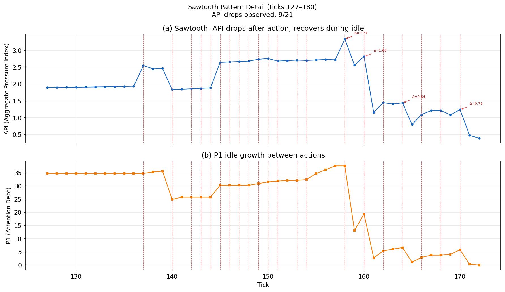
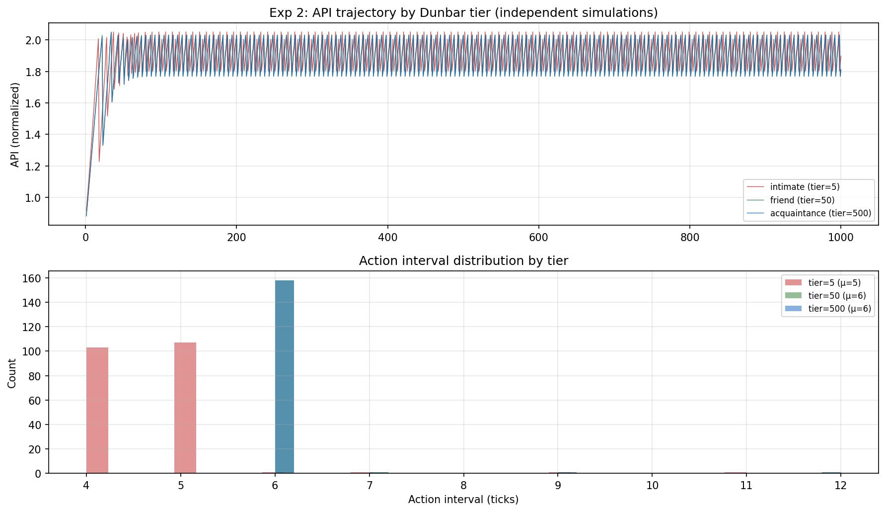
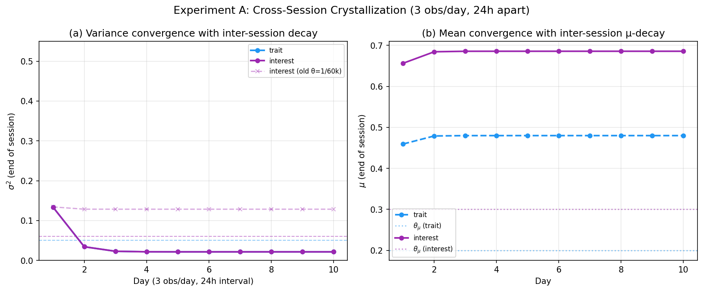
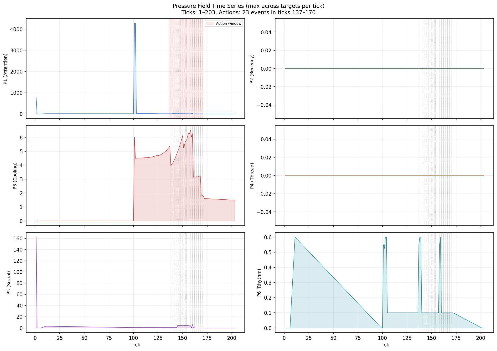

> [!CAUTION]
> This project was **designed, coded, tested, and documented entirely by AI agents**. The human author directed the vision and made decisions, but does not have the capacity to maintain this codebase alone — it has grown far too complex. Contributions and forks are welcome, but please understand the maintenance reality before depending on this project.

<h1 align="center">Alice</h1>

<p align="center">
  <a href="https://github.com/LlmKira/alice"></a>
  <a href="https://t.me/Openai_LLM"></a>
  <a href="https://github.com/LlmKira/alice/issues"></a>
</p>

<p align="center">
  <a href="https://www.ohmygpt.com">
    
  </a>
</p>

---

Have you ever closed a chat app, and wondered — does anyone on the other side notice you've gone quiet?

With ChatGPT, Character.ai, Replika — the answer is no. You close the window, and they stop existing. They don't wonder where you went. They don't notice your friend hasn't been heard from in two weeks. They don't remember that you promised someone a book recommendation last Thursday.

**Alice is our attempt to change that.**

She lives on Telegram as a userbot — not behind an API, not in a chat window you open and close, but as an always-on entity sharing the same messenger you use every day. She has her own inner state that keeps running whether you talk to her or not. She builds relationships with the people around her. She sleeps at night and wakes up in the morning.

We didn't set out to build a smarter chatbot. We wanted to answer a different question:

> *What happens when you give an LLM a nervous system — and let it live in a real social environment?*

## Why Not Just a Chatbot?

Every AI chatbot today follows the same interaction pattern:

```
Human social life:   A thinks of B → A reaches out → conversation → B thinks of A → ...
AI interaction:      You send message → AI replies → end
                     You send message → AI replies → end
                     You send message → AI replies → end
```

The first is a **bidirectional relationship**. The second is a **unidirectional tool call**. There is no "AI thinks of you" step — because the AI has no internal state that keeps running.

Alice has that state. It's called a **pressure field** — six forces derived from the *real physical constraints* of digital existence. Not simulated hunger or loneliness, but genuine pressures: finite attention (bounded context windows), memory decay (information-theoretic retrieval limits), information staleness, and computational cost.

| | Force | Source constraint | What it feels like |
|-|-------|------------------|-------------------|
| **P1** | Attention Debt | Finite context window — can't process everything at once | *"Something just happened over there"* |
| **P2** | Information Pressure | Memory decays without maintenance; knowledge has a shelf life | *"I'm losing track of what we talked about"* |
| **P3** | Relationship Cooling | Social bonds decay without interaction — equally real for digital and human entities | *"We haven't talked in a while"* |
| **P4** | Thread Divergence | Open commitments accumulate urgency the longer they go unresolved | *"There's something unresolved between us"* |
| **P5** | Response Obligation | Directed messages create social debt that grows with silence | *"Someone is waiting for my reply"* |
| **P6** | Curiosity | Information entropy deficit — the drive to reduce uncertainty about the world | *"Something interesting might be happening"* |

These forces feed into four competing inner voices — **Diligence** (process tasks, fulfill commitments), **Curiosity** (explore, learn, share discoveries), **Sociability** (maintain relationships, chat), and **Caution** (wait when uncertain). Each voice's *loudness* is weighted by an evolving personality vector π ∈ Δ³. The loudest voice picks the next target. Then an LLM writes a shell script to act.

The approach is inspired by physics rather than ethology. Instead of specifying "what a good companion should do" (telling a bird "you should have wings"), we define the *laws governing the companion's world* (gravity and aerodynamics) and let behavior emerge. We prove two formal guarantees:

- **Non-Quiescence** — as long as open commitments or active relationships exist, aggregate pressure grows super-linearly, ensuring Alice *cannot* fall permanently silent
- **Structural Homeostasis** — built-in negative feedback prevents pressure divergence, producing natural rhythm as a corollary

No intent detection. No slot filling. No state machines. Just physics.

## What We Actually Want

We don't want a better chatbot. We want an entity that can:

- **Be a night watchman** — While you sleep, she reads 200 messages across 3 groups, answers the important @mention, tells your friend you'll reply tomorrow, and gives you a morning briefing.

- **Maintain your relationships** — She notices you haven't talked to an old friend in two weeks. She forwards them an article they'd like, with a note: *"Saw this and thought of you."* She doesn't spam — she knows who likes being reached out to, and who prefers silence.

- **Hunt your promises** — You said "I'll send you the doc by Friday." Thursday evening, she reminds you. Not as a calendar notification — in the right conversation, at the right moment.

- **Exist in group chats** — She listens mostly. Occasionally contributes when she knows something. Helps when nobody else answers. Has her own opinions and style. Never dominates.

- **Grow over six months** — Her personality drifts. Her understanding of you deepens. She develops shared memories. She occasionally surprises you — not from bugs, but from emergent behavior.

- **Handle crises** — When she detects your behavior pattern suddenly changes (you're firing messages in one chat, ignoring everything else), she goes quiet everywhere else and asks *"Are you okay?"* after it's over.

> The full vision — nine scenarios, interaction primitives, ethical boundaries — is documented internally in our goal specification. What you see here is a living system pursuing that vision.

## Field-Validated

Alice is not a proof-of-concept. She has been running 24/7 on real Telegram accounts, in real conversations with real people — across private chats, group chats, and supergroups. The pressure field model has been validated through simulation experiments driven by Telegram chat export data spanning 1,000+ days of conversation history.

Every design decision went through a formal Architecture Decision Record (226 ADRs and counting), with simulation validating the model before deployment and production logs validating it after.

<table>
<tr>
<td width="50%">

**Sawtooth Pattern** — Pressure builds during idle, drops on action, rebuilds. This is Alice's heartbeat: a self-regulating cycle that emerges from the math, not from timers.

</td>
<td width="50%">



</td>
</tr>
<tr>
<td width="50%">

**Dunbar Tiers** — Intimate friends get frequent attention, acquaintances get less. The system follows Dunbar's social brain hierarchy — different pressure accumulation rates, no hand-tuned rules.

</td>
<td width="50%">



</td>
</tr>
<tr>
<td width="50%">

**Personality Crystallization** — Over days, Alice's perception of each person converges and stabilizes. Variance drops as observations accumulate — like actually getting to know someone.

</td>
<td width="50%">



</td>
</tr>
<tr>
<td width="50%">

**Six-Force Decomposition** — Real-time pressure across all dimensions. P1 spikes on new messages, P5 rises when someone is waiting, P6 builds during quiet periods.

</td>
<td width="50%">



</td>
</tr>
</table>

## Current Progress

- [x] **Autonomous decision-making** — pressure field dynamics, not if-else chains
- [x] **Three competing voices** — care / play / duty with personality vectors
- [x] **Habituation** — attention naturally decays with repeated exposure
- [x] **Circadian rhythm** — dormant mode with sleep/wake cycles
- [x] **Working memory** — diary that consolidates and forgets like a real one
- [x] **Social reception** — backs off when ignored, leans in when welcomed
- [x] **Multi-chat awareness** — social panorama across all conversations
- [x] **Topic clustering** — LLM-powered automatic thread detection
- [x] **Extensible skills** — weather, music, search, calendar, and more
- [x] **Sticker expressions** — context-aware emotional selection
- [x] **Vision** — understands photos, stickers, and media
- [x] **Voice synthesis** — TTS voice message generation
- [x] **Impression formation** — Bayesian belief system that crystallizes personality traits over repeated observations
- [x] **Channel awareness** — subscribes, reads, digests, and forwards content from Telegram channels
- [ ] Voice transcription (incoming voice → text)
- [ ] Crisis mode (behavioral anomaly detection → automatic quiet mode)
- [ ] Autonomous exploration (interest-driven channel/group discovery)

## Architecture

```
Perceive ──→ Evolve ──→ Act
(events)    (pressure)  (LLM → shell scripts → Telegram)
```

- **Perceive** — Telegram events flow in, the companion graph updates, pressure contributions accumulate
- **Evolve** — Six forces compute, voices compete, a target is selected
- **Act** — An LLM writes a shell script, the sandbox executes it, Telegram actions fire

The whole system runs on a tick loop. Every tick, the pressure field evolves. When pressure crosses threshold, Alice acts. When she acts, pressure releases. Then it builds again — the sawtooth heartbeat.

## Quick Start

```bash
git clone --recurse-submodules https://github.com/LlmKira/alice.git
cd alice/runtime

pnpm install
cp .env.example .env   # configure Telegram session + LLM endpoint
pnpm run db:migrate
pnpm run dev           # first run: interactive Telegram login
```

After login, use pm2 for production:

```bash
pm2 start ecosystem.config.cjs   # starts runtime + wd-tagger + anime-classify
```

**[Full deployment guide →](docs/deployment.md)** — Telegram credentials, LLM setup, auxiliary services, systemd hardening, troubleshooting.

### Simulation

The pressure field model has a standalone Python simulation for validation:

```bash
cd simulation && uv sync && uv run python run_all.py
```

### Prerequisites

- Node.js 20+ / pnpm
- Python 3.13+ / [uv](https://github.com/astral-sh/uv) + [pdm](https://pdm-project.org/) (auxiliary services)
- A Telegram account (userbot, not bot API)
- An OpenAI-compatible LLM endpoint

## Project Structure

```
runtime/                    # TypeScript — the living system
├── src/engine/             # Three-thread loop (perceive/evolve/act)
├── src/pressure/           # P1-P6 force computation
├── src/voices/             # Voice competition + personality vectors
├── src/graph/              # Companion graph (entities + relations)
├── src/telegram/           # @mtcute MTProto client
├── src/mods/               # Diary, observer, clustering, ...
├── src/skills/             # App toolkit (weather, music, ...)
├── src/db/                 # SQLite + Drizzle ORM
└── test/                   # vitest

simulation/                 # Python — the proving ground
├── pressure.py             # Six-force calculations
├── voices.py               # Voice competition
├── sim_engine.py           # Tick-by-tick evolution
└── experiments/            # 10 validation experiments
```

## Tech Stack

| | Technology |
|-|-----------|
| Runtime | TypeScript, Node.js, tsx |
| Telegram | [@mtcute](https://github.com/mtcute/mtcute) (MTProto) |
| Database | SQLite + [Drizzle ORM](https://orm.drizzle.team/) |
| LLM | OpenAI-compatible API |
| Validation | [zod](https://zod.dev/) |
| Tests | [vitest](https://vitest.dev/) |
| Simulation | Python, NetworkX, NumPy, SciPy |

## Standing on the Shoulders of

Alice didn't come from nowhere. The pressure field model and companion architecture draw directly from established theory and remarkable open-source projects:

**Theoretical Foundations**

- **The Sims / IAUS** — Target selection adapts the [Infinite Axis Utility System](http://www.gdcvault.com/play/1021848/Building-a-Better-Centaur-AI) from [The Sims](https://en.wikipedia.org/wiki/The_Sims) (Wright, 2000). Multi-dimensional need decay → behavior selection via utility competition. Alice replaces simulated biological needs with digital-native pressure functions.
- **Disco Elysium** — The four-voice system is a direct simplification of [ZA/UM's 24 competing skills](https://en.wikipedia.org/wiki/Disco_Elysium). Decisions emerge from competition, not optimization.
- **Dwarf Fortress** — Multi-dimensional personality with dual-track emotions (short-term mood vs long-term stress) and memory-driven personality change. Alice inherits the personality-as-weight-vector paradigm.
- **Active Inference** — The pressure field shares the core intuition of [Friston's free-energy principle](https://en.wikipedia.org/wiki/Free_energy_principle): behavior is gradient descent on an internally maintained scalar. P6 (Curiosity) directly corresponds to Active Inference's epistemic value.
- **Braitenberg Vehicles** — Simple sensor-motor couplings producing complex-seeming behavior. Alice operates on the same principle at a higher abstraction: pressure-action couplings (high P3 → social action, high P6 → exploration), with the LLM replacing the motor.
- **Dunbar's Number** — Social graph tiering follows [Robin Dunbar's social brain hypothesis](https://en.wikipedia.org/wiki/Dunbar%27s_number) (5 → 15 → 50 → 150 → 500). Validated by Gonçalves et al. (2011) as persistent in online networks.
- **Ebbinghaus / FSRS** — P2 memory decay uses the power-law forgetting curve (Ebbinghaus, 1885) with stability update following [Ye (2022)](https://github.com/open-spaced-repetition/fsrs4anki). Retrievability decays unless rehearsed; consolidation increases stability.
- **Weber-Fechner Law** — P1's tonic component uses logarithmic scaling of unread message counts, following the psychophysical law that subjective intensity grows logarithmically with stimulus magnitude.
- **Posner & Petersen** — P1's tonic/phasic decomposition follows the [two-component attention model](https://en.wikipedia.org/wiki/Attention#Posner_and_Petersen's_framework) (1990): phasic alerting for fresh stimuli, tonic vigilance for accumulated backlogs.
- **Anderson's Information Integration** — Impression formation uses weighted averaging of repeated observations (Anderson, 1965). Bayesian belief EMA with asymmetric update (Siegel, 2018).
- **Goffman's Participation Framework** — Group chat behavior follows [Goffman's](https://en.wikipedia.org/wiki/Erving_Goffman) ratified/unratified participant distinction. Alice knows she's not always the addressee.
- **Prigogine's Dissipative Structures** — Alice's behavioral rhythm can be interpreted as a dissipative structure: continuous pressure influx maintains the system far from equilibrium, and periodic action pulses constitute emergent temporal order.
- **Wiener's Cybernetics** — Structural homeostasis is a direct application of negative feedback loops producing self-regulating systems.
- **Stanford Generative Agents** — Memory architecture builds on [Park et al. (2023)](https://arxiv.org/abs/2304.03442)'s three-layer model, but couples memory to the pressure field: memory *generates* pressure (P2) that drives consolidation as autonomous behavior.
- **Spectral Graph Theory** — Pressure propagation across the social graph uses Laplacian-based diffusion. The Fiedler value (algebraic connectivity) determines propagation strength.

**Open-Source Projects We Learned From**

- [**Project AIRI**](https://github.com/moeru-ai/airi) — Pioneering open-source digital companion. Inspiration for the "living entity" philosophy and README storytelling.
- [**OpenClaw**](https://github.com/openclaw/openclaw) — The gold standard for companion architecture at scale. Skill system design reference.
- [**mem0**](https://github.com/mem0ai/mem0) — Memory layer abstraction (CRUD + decay + retrieval). Informed our diary and fact memory design.
- [**Concordia**](https://github.com/google-deepmind/concordia) — Google DeepMind's generative social simulation. ActionSpec pattern and component-based entity design.
- [**Voyager**](https://github.com/MineDojo/Voyager) — Embodied lifelong learning agent. Code-as-Skill pattern and progressive disclosure of action space.
- [**mtcute**](https://github.com/mtcute/mtcute) — The MTProto client that makes Alice's Telegram existence possible.

**Ancestor Projects**

Alice's pressure field model evolved from two predecessor projects by the same author:
- A **narrative dynamics paper** — graph-theoretic state management (G=(V,E,φ)), priority function families, Laplacian propagation, and the tanh(P/κ) saturation mapping.
- A **narrative engine** (production system) — the Mod architecture (defineMod/contribute/handle), QuickJS sandbox execution, and the Storyteller context assembly pattern.

## Sponsor

<a href="https://www.ohmygpt.com">
  
</a>
